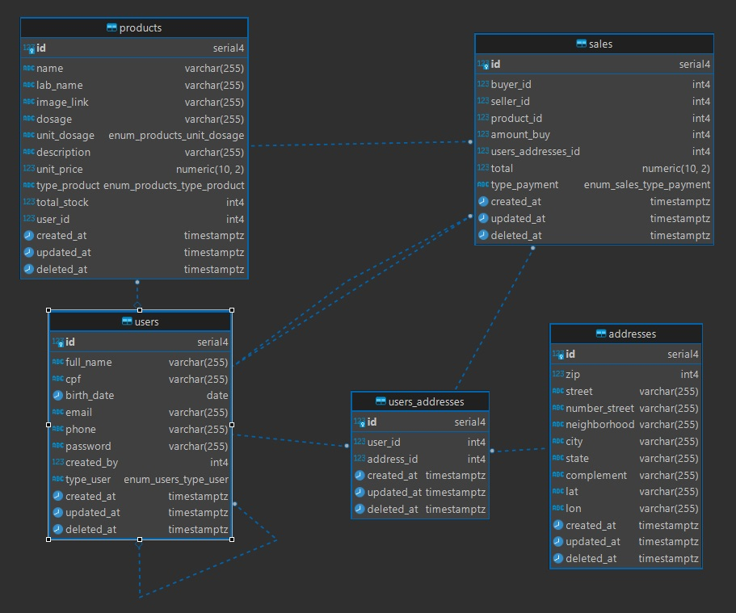

# API de Backend da LAB Pharmacy Inc.

Bem-vindo ao repositório da API de Backend da LAB Pharmacy Inc. Este robusto backend é a força motriz por trás de nosso marketplace de fácil utilização, projetado para permitir acesso seguro e conveniente a uma ampla variedade de produtos farmacêuticos. Utilizando tecnologia de ponta como Node.js, Express e Sequelize ORM com um banco de dados PostgreSQL, garantimos que tanto os usuários quanto os administradores tenham uma experiência fluida na gestão e aquisição de medicamentos.

## Funcionalidades

- Autenticação de Usuário (vendedor e comprador) Segura: Um processo de login simplificado que garante a proteção dos dados do usuário.
- Cadastro de usuário: Processo de cadastramento de usuários conforme a atividade no marketplace.
- Gerenciamento do Catálogo de Produtos: Um sistema abrangente para administradores gerenciarem as listagens farmacêuticas.
- Processamento de Pedidos: Sistemas eficientes em vigor para colocação, confirmação e rastreamento de pedidos.
- Transações de Pagamento: Métodos de processamento de pagamento seguros e confiáveis.
- Relatórios de Análises: Análises de dados perspicazes para que os administradores otimizem as operações.

## Tecnologias

- Node.js: Um ambiente de execução JavaScript construído no motor JavaScript V8 do Chrome.
- Express: Um framework de aplicação web flexível e minimalista para Node.js.
- Sequelize: Um ORM Node.js baseado em promessas para Postgres, MySQL, MariaDB, SQLite e Microsoft SQL Server.
- PostgreSQL: Um banco de dados relacional de código aberto com uma sólida reputação de confiabilidade, robustez de recursos e desempenho.

### Diagrama do Banco de Dados



## Endpoints da API

Nossa API fornece um conjunto de endpoints para apoiar todas as operações necessárias na plataforma. Abaixo estão alguns dos principais endpoints:

#### Autenticação do Usuário
- **POST /user/login**: Este endpoint deve efetuar o login de um usuário comprador e/ou administrador na aplicação.
- **POST /user/admin/login**: Este endpoint deve efetuar o login de um usuário comprador e/ou administrador na aplicação.
- **POST /user/signup**: Este endpoint deve cadastrar um usuário comprador na aplicação.
- **POST /user/admin/signup**: Este endpoint deve cadastrar um usuário na aplicação.
- **POST /products/admin**: Este endpoint deve cadastrar um produto na aplicação.

#### Gestão de Produtos
- **GET /products/admin/:offset/:limit**: Este endpoint deve listar todos os produtos cadastrados daquele usuário administrador.
- **GET /products/:offset/:limit**: Este endpoint deve listar todos os produtos cadastrados na aplicação.
- **GET /products/:productId**: Este endpoint deve listar uma especificação do produto selecionado pelo id

#### Gestão dos Usuários (Admin)
- **GET /buyers/address**: Este endpoint deve listar todos os endereços cadastrados do usuário
- **PATCH /products/admin/:productId**: Este endpoint deve atualizar alguns campos do produto na aplicação.
- **GET /buyers/admin/:offset/:limit**: Este endpoint deve listar todos os usuários
- **GET /buyers/admin/:userId**: Este endpoint deve listar todos os usuários
- **GET /buyers/admin/:userId**: Este endpoint deve listar uma especificação do usuário selecionado pelo id

#### Gestão das Vendas

- **POST /sales/**: Este endpoint deve criar registros de venda na aplicação.
- **GET /sales/**: Este endpoint deve fornecer todas as compras que aquele comprador realizou.
- **GET /sales/admin**: Este endpoint deve fornecer todas as vendas que aquele administrador realizou.
- **GET /sales/dashboard/admin**: Este endpoint deve fornecer resultados financeiros a partir das vendas realizadas.

### Começando
#### Clone o projeto 
```bash
git clone https://github.com/FullStack-Itaguacu/M3P-BackEnd-Squad5
```
#### Navegue até o diretório do projeto
```bash
cd <diretório do projeto>
```
#### Instale as dependências
``` bash
npm install
```
#### Configurar o Banco de Dados PostgreSQL
- Certifique-se de ter o PostgreSQL instalado e funcionando em sua máquina.
- Crie um banco de dados para o projeto.

#### Configurar Variáveis de Ambiente
Crie um arquivo .env na raiz do projeto e inclua as variáveis de ambiente necessárias:
```bash
DB_NAME=<NOME DO BANCO DE DADOS>
DB_USER=<USUÁRIO>
DB_PASSWORD=<PASSWORD>
DB_HOST=<ENDEREÇO DO SERVIDOR>
DB_DIALECT=<BANCO DE DADOS>
DB_PORT=<PORTA>

JWT_SECRET_KEY=<INSERIR JWT_SECRET_KEY>

CORS_HOST=<INSERIR IPs PERMITIDOS>
```
#### Executar Migrações

```bash
npx sequelize-cli db:migrate
```
#### Iniciar o Servidor
```bash
npm run start
```
### Documentação
Para **documentação detalhada da API**, incluindo exemplos de **requisições/respostas**, descrições de parâmetros e códigos de erro, consulte a rota **`/api-docs`** uma vez que o servidor esteja em execução, onde você encontrará nossa documentação **Swagger UI**.

### Contribuições
As contribuições são o que tornam a comunidade de código aberto um lugar incrível para aprender, inspirar e criar. Quaisquer contribuições para a API de Backend da LAB Pharmacy Inc. são muito apreciadas. Se você tem sugestões, por favor, faça um fork do repositório e crie um pull request ou abra um issue com a tag "enhancement".

Obrigado por fazer parte da família LAB Pharmacy Inc. Estamos comprometidos em entregar excelência no comércio eletrônico farmacêutico com a sua segurança e conveniência como nossas principais prioridades.